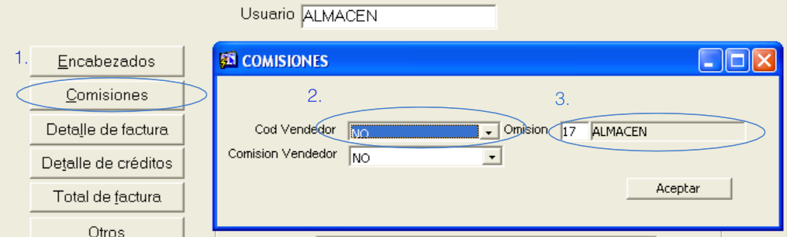

# RoiD.js
API Rest for order sales, prices, barcode and customer from Oracle Database 

## Requirements
- Private database (Not available in this repository) Contact me for information.
- Oracle Database
- Instant Client 19
- SQLcl
- Node 22
- pnpm
## Upgrade database
- Go to sql folder.
- Sign in database with sql (SQLcl)
- Run 2 times:
```
@upgrade.sql
```
## Set Parameters

## Configure database connection
In .env file, set NODE_ORACLEDB_LIBDIR to your oracle client lib folder.
## Run
```
pnpm run dev
```
## Format
```
pnpm run format
```
## Docker
Build image:
```
docker build . -t roid:latest
```
Run container:
```
docker run --name roid roid:latest
```
## Docker Compose
```
docker-compose up -d --build
```
## Docker Compose Down
```
docker-compose down
```
## Show active ports
- MacOS
```
lsof -i -P | grep LISTEN
```
```
netstat -an | grep LISTEN
```
- GNU/Linux
```
netstat -tulpn
```
## Kill process on MacOS
```
kill -9 $(lsof -t -i:3000) 
```